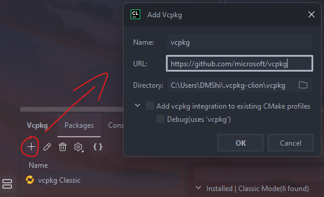

# SDL2 s Vcpkg a CMAKE (CLion)
## Instalace Vcpkg
1. Vcpkg najdeme pod `View -> Tool Windows -> Vcpkg`  
2. Kliknutím na `+` přidáme vcpkg:  

 
## Vcpkg instalace SDL2
V záložce `Packages` můžeme balíčky hledat: 

Po nalezení potřebujeme vybrat triplet který bude fungovat s naším kompilátorem (na Windowsu např. MinGW):  

## přidání SDL2 do CMakeLists.txt
Po instalaci SDL2 by se mělo objevit upozornění kde je možné kliknout na `Add to CMakeLists` nebo něco podobného.  
Pokud se nic takového neobjeví, můžeme potřebný kód nalézt v `[vcpkg root]/vcpkg/installed/[triplet]/share/sdl2/` a tady **usage** file:

    sdl2 provides CMake targets:

        find_package(SDL2 CONFIG REQUIRED)
        target_link_libraries(main
            PRIVATE
            $<TARGET_NAME_IF_EXISTS:SDL2::SDL2main>
            $<IF:$<TARGET_EXISTS:SDL2::SDL2>,SDL2::SDL2,SDL2::SDL2-static>
        )
- find_package půjde nad add_executables
- target_link_libraries pod add_executables  

Triplet např.: **x64-mingw-static**  
Vcpkg root obvykle: `C:/users/username/.vcpkg-clion`

CMakeLists.txt by poté mělo vypadat takto:

## Nastavení toolchainu a tripletu který bude projekt používat
Poté co máme SDL2 nakonfigurovaný a nalinkovaný v CMakeLists.txt je ještě potřeba nastavit toolchain, který basically zajistí, že vcpkg bude fungovat s aktuálním CMake projektem. Dále poté triplet, což znamená **target environment** nebo také **target configuration set**.

Bude potřeba jít do `nastavení (Ctrl + Shift + S) -> Build, Execution, Deployment -> CMake`
A tam pod CMake options doplnit:  

Toolchain:  

    -DCMAKE_TOOLCHAIN_FILE=C:/Users/username/.vcpkg-clion/vcpkg/scripts/buildsystems/vcpkg.cmake

Triplet:

    -DVCPKG_TARGET_TRIPLET="x64-mingw-static"

Příklad: 

Poté by měl projekt s SDL2 fungovat bez problémů.
Možná také bude potřeba reloadnout CMake což jde udělat přes kliknutí na CMake záložku vlevo dole a kliknutím na ozubené kolečko vybrat `Reset Cache and Reload Project`:  

